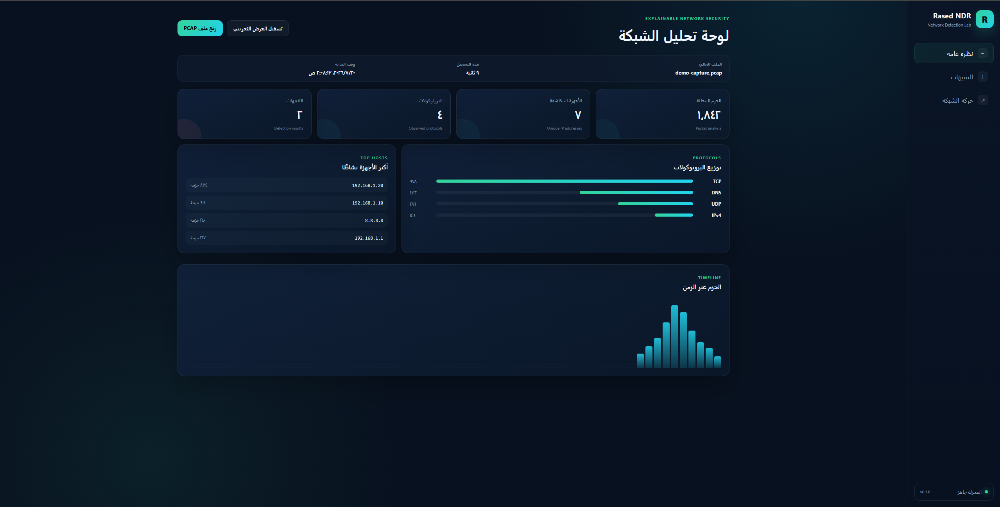
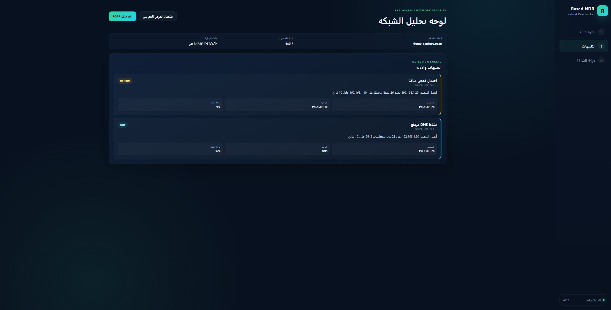
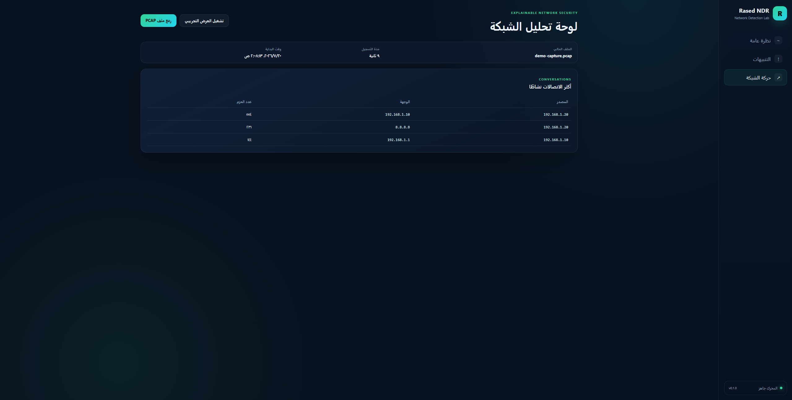

# Rased NDR

An open-source platform for PCAP analysis and explainable network detection.


## Overview

**Rased NDR** is a defensive network-analysis project that extracts useful information from packet captures and applies simple detection rules to identify potentially suspicious activity.

The platform focuses on explainability: every alert includes a reason, source, destination, confidence score, and supporting evidence.

It is designed for students and practitioners interested in:

- Network security
- Packet analysis
- Network Detection and Response
- Blue Team operations
- PCAP investigation
- Explainable detection engineering

## Current Features

- Responsive English dashboard
- Upload and analysis of `.pcap`, `.pcapng`, and `.cap` files
- Packet, device, and protocol statistics
- Most active hosts and network conversations
- Possible port-scan detection
- Unusual DNS activity detection
- Explainable alerts with confidence scores
- Packet timeline visualization
- Built-in demo mode
- FastAPI backend and interactive API documentation
- Docker support

## Screenshots

### Overview



### Detection Alerts



### Network Traffic



> After switching the interface to English, replace these screenshots with updated English versions using the same filenames.

## Requirements

- Python 3.11 or later
- pip
- A modern web browser
- Docker is optional

## Run on Windows

Open PowerShell inside the project directory and create a virtual environment:

```powershell
py -m venv .venv
```

Activate the environment:

```powershell
.\.venv\Scripts\Activate.ps1
```

Install the dependencies:

```powershell
pip install -r requirements.txt
```

Start the application:

```powershell
uvicorn app.main:app --reload
```

Open:

```text
http://127.0.0.1:8000
```

You can also run the project without activating the environment:

```powershell
.\.venv\Scripts\python.exe -m pip install -r requirements.txt
.\.venv\Scripts\python.exe -m uvicorn app.main:app --reload
```

## Run on Linux or macOS

Create and activate a virtual environment:

```bash
python3 -m venv .venv
source .venv/bin/activate
```

Install the dependencies and start the application:

```bash
pip install -r requirements.txt
uvicorn app.main:app --reload
```

Open:

```text
http://127.0.0.1:8000
```

## Run with Docker

Build and start the project:

```bash
docker compose up --build
```

Open:

```text
http://127.0.0.1:8000
```

Stop the containers:

```bash
docker compose down
```

## API Endpoints

| Method | Endpoint | Description |
|---|---|---|
| GET | `/` | Open the web dashboard |
| GET | `/api/health` | Check service health |
| POST | `/api/demo` | Return demo analysis data |
| POST | `/api/analyze` | Upload and analyze a packet capture |

Interactive FastAPI documentation:

```text
http://127.0.0.1:8000/docs
```

ReDoc documentation:

```text
http://127.0.0.1:8000/redoc
```

## Current Detection Rules

### RASED-NET-001 — Possible Port Scan

This alert is generated when one source contacts at least 15 unique destination ports on the same host within 10 seconds.

Example:

```text
Source: 192.168.1.20
Destination: 192.168.1.10
Unique ports: 26
Time window: 10 seconds
Severity: Medium
```

Possible legitimate causes include monitoring software, administrative automation, and applications that create many short-lived connections.

### RASED-NET-002 — Unusual DNS Activity

This alert is generated when one source sends at least 25 DNS queries within 10 seconds.

Example:

```text
Source: 192.168.1.20
DNS queries: 28
Time window: 10 seconds
Severity: Low
```

Possible legitimate causes include applications that use many domains, background services, or unusual DNS configurations.

These rules are educational and may produce false positives in some environments.

## Supported Capture Formats

```text
.pcap
.pcapng
.cap
```

Maximum upload size:

```text
100 MB
```

Maximum packets analyzed per capture:

```text
500,000 packets
```

## Project Structure

```text
rased-ndr/
├── app/
│   ├── __init__.py
│   ├── main.py
│   └── services/
│       ├── __init__.py
│       ├── analyzer.py
│       └── demo.py
├── docs/
│   └── screenshots/
│       ├── overview.png
│       ├── alerts.png
│       └── traffic.png
├── frontend/
│   ├── index.html
│   ├── styles.css
│   └── app.js
├── tests/
│   └── test_demo.py
├── .gitignore
├── Dockerfile
├── docker-compose.yml
├── LICENSE
├── README.md
├── requirements.txt
└── SECURITY.md
```

## Tests

Run the test suite:

```bash
pytest
```

On Windows using the project virtual environment:

```powershell
.\.venv\Scripts\python.exe -m pytest
```

## Roadmap

- [ ] Add detailed alert evidence views
- [ ] Export HTML reports
- [ ] Export analysis results as JSON
- [ ] Add YAML-based detection rules
- [ ] Improve TLS and HTTP analysis
- [ ] Import Zeek logs
- [ ] Import Suricata logs
- [ ] Visualize network topology and relationships
- [ ] Store analyses in SQLite
- [ ] Add live packet-capture support
- [ ] Expand automated tests
- [ ] Add a plugin system for detection rules

## Technology Stack

- Python
- FastAPI
- Scapy
- HTML
- CSS
- JavaScript
- Docker
- Pytest

## Responsible Use

Rased NDR is intended for defensive analysis and education.

Only analyze:

- Captures you own
- Networks you are explicitly authorized to monitor
- Educational or laboratory packet captures
- Data that does not violate another person's privacy

Do not use this project to intercept or analyze network traffic without authorization.

## Data Protection

Packet captures may contain sensitive data, including:

- IP addresses
- Domain names
- Session information
- Unencrypted HTTP data
- Device names
- Internal network information

Do not publish real sensitive captures in a public repository. PCAP files are excluded through `.gitignore`.

## Contributing

Contributions are welcome.

1. Fork the repository.
2. Create a feature branch:

```bash
git checkout -b feature/new-feature
```

3. Commit your changes:

```bash
git commit -m "Add new detection feature"
```

4. Push the branch:

```bash
git push origin feature/new-feature
```

5. Open a pull request.

## Security Reports

Do not publish security vulnerabilities in public issues. Use GitHub Security Advisories or contact the repository owner privately.

See [`SECURITY.md`](SECURITY.md) for more information.

## License

This project is licensed under the MIT License. See [`LICENSE`](LICENSE).

## Project Status

```text
Version: 0.1.1
Status: Early Development
Focus: PCAP Analysis and Explainable Network Detection
```
